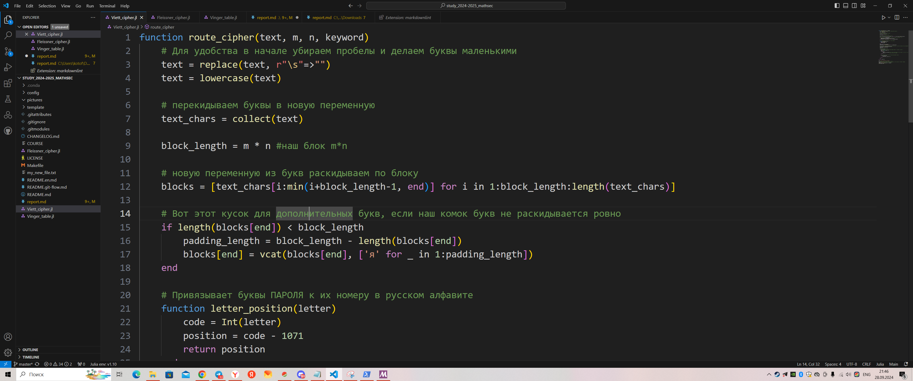
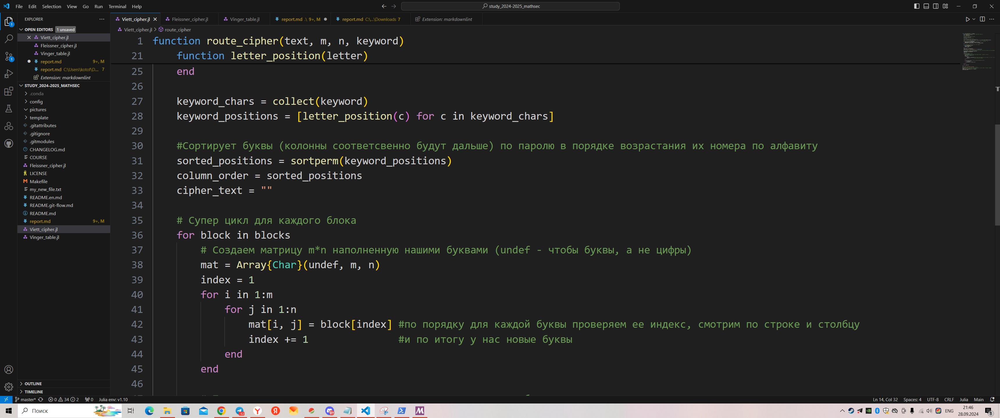
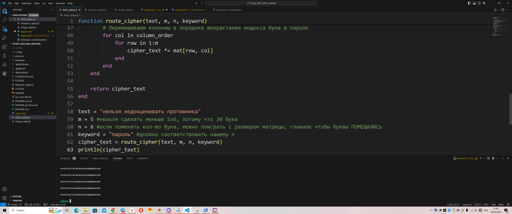
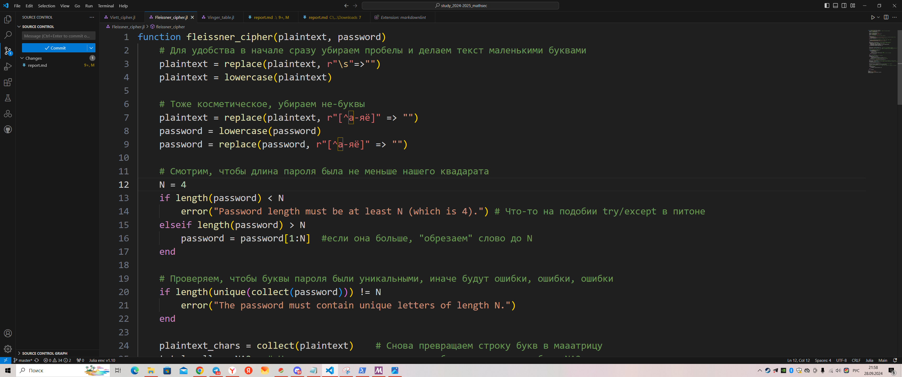
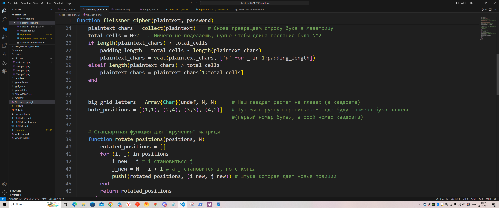
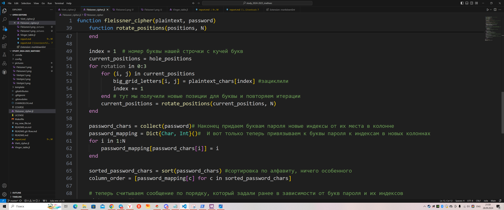
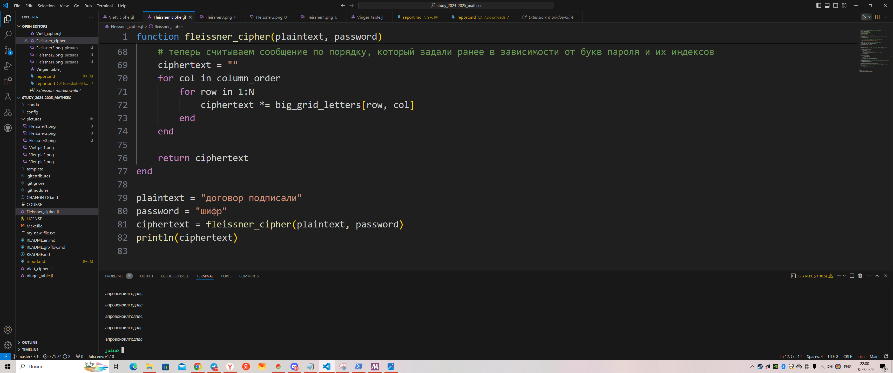
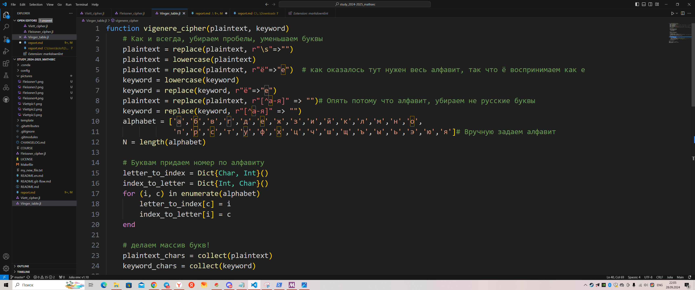
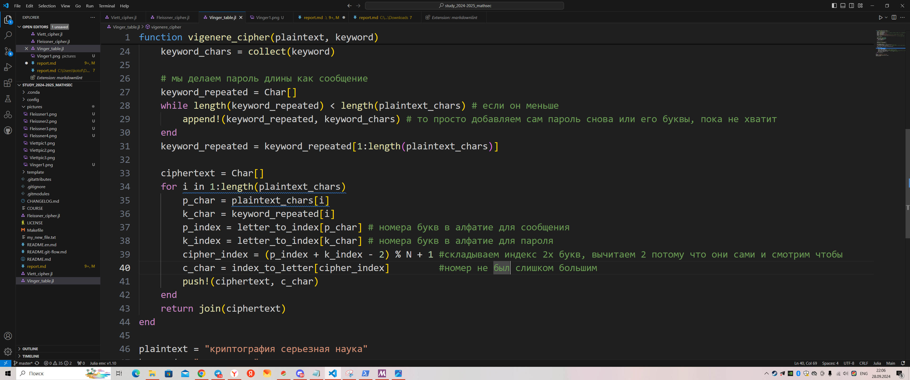
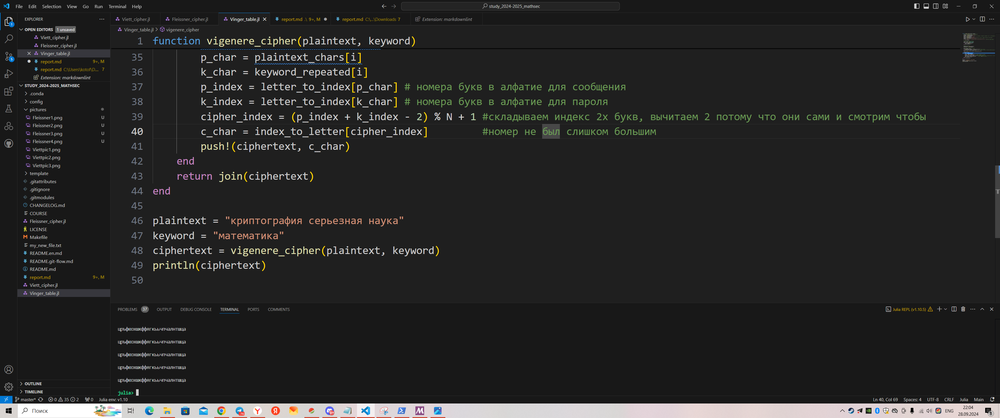

---
## Front matter
title: "Отчет по Лабораторной работе №2 по предмету Математические основы зищаты информации и информационной безопасности"
author: "Лобов Михаил Сергеевич"

## Generic otions
lang: ru-RU
toc-title: "Содержание"

## Bibliography
bibliography: bib/cite.bib
csl: pandoc/csl/gost-r-7-0-5-2008-numeric.csl

## Pdf output format
toc: true # Table of contents
toc-depth: 2
lof: true # List of figures
lot: true # List of tables
fontsize: 12pt
linestretch: 1.5
papersize: a4
documentclass: scrreprt
## I18n polyglossia
polyglossia-lang:
  name: russian
  options:
    - spelling=modern
    - babelshorthands=true
polyglossia-otherlangs:
  name: english
## I18n babel
babel-lang: russian
babel-otherlangs: english
## Fonts
mainfont: IBM Plex Serif
romanfont: IBM Plex Serif
sansfont: IBM Plex Sans
monofont: IBM Plex Mono
mathfont: STIX Two Math
mainfontoptions: Ligatures=Common,Ligatures=TeX,Scale=0.94
romanfontoptions: Ligatures=Common,Ligatures=TeX,Scale=0.94
sansfontoptions: Ligatures=Common,Ligatures=TeX,Scale=MatchLowercase,Scale=0.94
monofontoptions: Scale=MatchLowercase,Scale=0.94,FakeStretch=0.9
mathfontoptions:
## Biblatex
biblatex: true
biblio-style: "gost-numeric"
biblatexoptions:
  - parentracker=true
  - backend=biber
  - hyperref=auto
  - language=auto
  - autolang=other*
  - citestyle=gost-numeric
## Pandoc-crossref LaTeX customization
figureTitle: "Рис."
tableTitle: "Таблица"
listingTitle: "Листинг"
lofTitle: "Список иллюстраций"
lotTitle: "Список таблиц"
lolTitle: "Листинги"
## Misc options
indent: true
header-includes:
  - \usepackage{indentfirst}
  - \usepackage{float} # keep figures where there are in the text
  - \floatplacement{figure}{H} # keep figures where there are in the text
---

# Цель работы

Изучить шифры перестановки

# Задание

Программно реализовать на языке Julia шифры:
1. Маршрутное шифрование
2. Шифрование с помощью решеток
3. Таблица Вижнера

# Теоретическое введение

## Маршрутное шифрование

Открытый текст разбивается на блоки равной длины, состоящие из числа символов, равного произведению m𝑛. Если последний блок получится меньше остальных, то в него следует дописать требуемое количество произвольных символов. Составляется таблица размерности m𝑛. Блоки вписываются построчно в таблицу. Криптограмма получается выписыванием букв из таблицы в соответствии с некоторым маршрутом. Ключом такой криптограммы является маршрут и числа m и 𝑛. Обычно буквы выписывают по столбцам, которые упорядочивают согласно паролю: внизу таблицы приписывается слово из 
n неповторяющихся букв и столбцы нумеруются по алфавитному порядку букв пароля.

## Шифрование с помощью решеток

Суть этого способа заключается в следующем. Выбирается натуральное число $k > 1$, строится квадрат размерности $k \times k$ и построчно заполняется числами $1, 2, \dots, k^2$. В качестве примера рассмотрим квадрат размерности $k = 2$.

$$
\begin{matrix}
1 & 2 \\
3 & 4
\end{matrix}
$$

Повернем его по часовой стрелке на $90^\circ$ и присоединим к исходному квадрату справа.

$$
\begin{matrix}
1 & 2 & 3 & 1 \\
3 & 4 & 4 & 2
\end{matrix}
$$

Проделаем еще дважды такую процедуру и пришьем получившиеся квадраты снизу. Получился большой квадрат размерности $2k$.

$$
\begin{matrix}
1 & 2 & 3 & 1 \\
3 & 4 & 4 & 2 \\
2 & 4 & 3 & 4 \\
1 & 3 & 2 & 1
\end{matrix}
$$

Далее из большого квадрата вырезаются клетки, содержащие числа от 1 до $k^2$. В каждой клетке должно быть только одно число. Получается своего рода решето. Шифрование осуществляется следующим образом. Решето накладывается на чистый квадрат $2k \times 2k$ и в прорези вписываются буквы исходного текста по порядку их следования. Когда заполнятся все прорези, решето поворачивается на $90^\circ$ и вписывание букв продолжается. После третьего поворота все клетки большого квадрата окажутся заполненными. Подобрав подходящий пароль (число букв пароля должно равняться $k^2$ и они не должны повторяться), выпишем буквы по столбцам. Очередность столбцов определяется алфавитным порядком букв пароля.

**Пример.** Исходный текст — *договор подписали*; пароль — *шифр*. С применением вышеуказанной решетки за пять шагов получаем следующую криптограмму.

$$
\begin{matrix}
д & о & д & о \\
г & о & а & в \\
о & р & п & и \\
п & о & д & п \\
с & а & л & и \\
и & ш & ф & р
\end{matrix}
$$

Получившаяся криптограмма: `ОВОРДЛГПАПИОСДОИ`. Важно отметить, что число клеток подбирается в соответствии с количеством букв в исходном тексте. В идеальном случае $k^2 = n$. Если такого равенства достичь невозможно, можно либо дописать произвольную букву к последнему слову открытого текста, либо убрать её.""

## Таблица Виженера

В 1585 году французский криптограф Блез Виженер опубликовал свой метод шифрования в «Трактате о шифрах». Шифр считался нераскрываемым до 1863 года, когда австриец Фридрих Казиски взломал его.

Открытый текст разбивается на блоки длины $n$. Ключ представляет собой последовательность из $n$ натуральных чисел: $a_1, a_2, \dots, a_n$. Далее в каждом блоке первая буква циклически сдвигается вправо по алфавиту на $a_1$ позиций, вторая буква — на $a_2$ позиций, последняя — на $a_n$ позиций. Для лучшего запоминания в качестве ключа можно взять осмысленное слово, а алфавитные номера входящих в него букв использовать для осуществления сдвигов. Рассмотрим еще одну схему построения шифра Виженера.

В нижеприведенной таблице в строчках записаны буквы русского алфавита. При переходе от одной строки к другой происходит циклический сдвиг на одну позицию. Исходный текст: *криптография серьезная наука*; пароль — *математика*. Пароль записывается с повторениями над буквами сообщения.

| м | а | т | е | м | а | т | и | к | а | м | а | т | е | м | а | т | и | к | а | м | а | т | е | м | а |
|---|---|---|---|---|---|---|---|---|---|---|---|---|---|---|---|---|---|---|---|---|---|---|---|---|---|
| к | р | и | п | т | о | г | р | а | ф | и | я | с | е | р | ь | е | з | н | а | я | н | а | у | к | а |

АБВГДЕЖЗИЙКЛМНОПРСТУФХЦЧШЩЪЫЬЭЮЯ 

БВГДЕЖЗИЙКЛМНОПРСТУФХЦЧШЩЪЫЬЭЮЯАБ 

ВГДЕЖЗИЙКЛМНОПРСТУФХЦЧШЩЪЫЬЭЮЯАБВ 

ГДЕЖЗИЙКЛМНОПРСТУФХЦЧШЩЪЫЬЭЮЯАБВГ 

ДЕЖЗИЙКЛМНОПРСТУФХЦЧШЩЪЫЬЭЮЯАБВГД 

ЕЖЗИЙКЛМНОПРСТУФХЦЧШЩЪЫЬЭЮЯАБВГДЕ 

ЖЗИЙКЛМНОПРСТУФХЦЧШЩЪЫЬЭЮЯАБВГДЕЖ 

ЗИЙКЛМНОПРСТУФХЦЧШЩЪЫЬЭЮЯАБВГДЕЖЗ 

ИЙКЛМНОПРСТУФХЦЧШЩЪЫЬЭЮЯАБВГДЕЖЗИ 

ЙКЛМНОПРСТУФХЦЧШЩЪЫЬЭЮЯАБВГДЕЖЗИЙ 

КЛМНОПРСТУФХЦЧШЩЪЫЬЭЮЯАБВГДЕЖЗИЙК 

ЛМНОПРСТУФХЦЧШЩЪЫЬЭЮЯАБВГДЕЖЗИЙКЛ 

МНОПРСТУФХЦЧШЩЪЫЬЭЮЯАБВГДЕЖЗИЙКЛМ 

НОПРСТУФХЦЧШЩЪЫЬЭЮЯАБВГДЕЖЗИЙКЛМН 

ОПРСТУФХЦЧШЩЪЫЬЭЮЯАБВГДЕЖЗИЙКЛМНО 

ПРСТУФХЦЧШЩЪЫЬЭЮЯАБВГДЕЖЗИЙКЛМНОП

В горизонтальном алфавите находим букву «к», а в вертикальном — букву «м». На пересечении столбца и строки в таблице расположена буква «ц». Далее переходим к буквам «р» и «а» соответственно. В итоге получается следующая криптограмма:

`ЦРЬФЯЮХШКФФЯДКЭЬЧПЧАЛНТЩЦА`.

# Выполнение лабораторной работы

Написаны программы на языке Julia.

{#fig:001 width=70%}
{#fig:001 width=70%}
{#fig:001 width=70%}
{#fig:001 width=70%}
{#fig:001 width=70%}
{#fig:001 width=70%}
{#fig:001 width=70%}
{#fig:001 width=70%}
{#fig:001 width=70%}
{#fig:001 width=70%}

# Выводы

По итогу проделанной работы были написаны 3 программы для каждого алгоритма шифрования. Программы успешно работают, без ошибок и могут принимать на вход различные данные, т.е. не привязаны к конкретным паролям или сообщениям. 

# Список литературы{.unnumbered}

::: {#[Лабораторная_работа_2](https://esystem.rudn.ru/mod/folder/view.php?id=1150970)}
:::